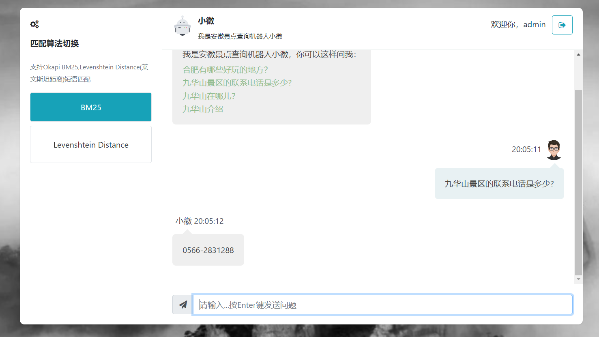

# Travel-NLP-QA 一个基于fuzzy,BM25语义分析算法的旅游景点问答系统

>  微信：bytecola ，有问题随时联系我！
<br />



> 主要开发语言

- 👉 [Python]() 
- 👉 [Javascript]() 
- 👉 [HTML5]() 
- 👉 [MongoDB]() 

> 所用开源框架

- 👉 [Flask v2.0]() 
- 👉 [Bootstrap v5]()


<br />

## ✨ **[主要功能]()**

- [x] **登录**
- [x] **旅游景点数据爬虫**
- [x] **景点数据语义分析**
- [x] **景点数据问答**

<br />

## ✨ 如何使用


<br />

> 👉 **[安装 Python3](https://www.runoob.com/python/python-install.html)** 


> 👉 **[安装虚拟环境模块](https://docs.python.org/zh-cn/3/library/venv.html)**


> 👉 **创建虚拟环境，安装依赖** 

```bash
$ python -m virtualenv env
$ .\env\Scripts\activate
$
$ # 下载安装依赖 - 默认使用SQLite数据库
$ pip3 install -r requirements.txt
```

<br />

> 👉 **设置环境变量**

```bash
$ # CMD terminal
$ set FLASK_APP=run.py
$ set FLASK_ENV=development
$
$ # Powershell
$ $env:FLASK_APP = ".\run_flask.py"
$ $env:FLASK_ENV = "development"
```

<br />

> 👉 **启动程序**

```bash
$ flask run 
```

程序启动主要页面

- 首页: `http://localhost:5000/`

<br />


## ✨ 项目结构

该项目使用blueprints、应用程序工厂模式、多配置配置文件（开发和生产）。项目文件结构如下：

```bash
< PROJECT ROOT >
   |
   |-- apps/
   |    |          
   |    |
   |    |-- authentication/                # Handles auth routes (login and register)
   |    |    |-- routes.py                 # Define authentication routes  
   |    |    |-- models.py                 # Defines models  
   |    |    |-- forms.py                  # Define auth forms (login and register) 
   |    |-- carwler/                       # 爬虫模块
   |    |    |-- crawler_ctrip_place.py    # 携程景区信息数据爬虫
   |    |    |-- crawler_ctrip_sight.py    # 携程网景点信息数据爬虫
   |    |-- chat/                          # 问答模块实现
   |    |    |-- routes.py                 # 路由方法定义
   |    |-- qa/                            # 问答算法实现
   |    |    |-- qabase.py                 
   |    |
   |    |-- static/
   |    |    |-- <css, JS, images>         # CSS files, Javascripts files
   |    |
   |    |-- templates/                     # Templates used to render pages
   |    |    |-- accounts/                 # 登录
   |    |    |
   |    |    |-- chat/                     # 问答聊天框页面
   |    |    |
   |    |    
   |  config.py                             # Set up the app
   |    __init__.py                         # Initialize the app
   |
   |-- requirements.txt                     # Development modules - SQLite storage
   |
   |
   |-- .env                                 # Inject Configuration via Environment
   |-- run_flask.py                               # Start the app - WSGI gateway
   |
   |-- ************************************************************************
```

<br />


## ✨ 部署


---

[Waitress](https://docs.pylonsproject.org/projects/waitress/en/stable/) 是一个具备生产级品质并有高性能的纯python编写独立的WSGI服务器，它只依赖python标准库，不依赖任何第三方库。

> 通过 pip 安装 Waitress

```bash
$ pip install waitress
```
> Start the app using [waitress-serve](https://docs.pylonsproject.org/projects/waitress/en/stable/runner.html)

```bash
$ waitress-serve --port=8001 run:app
Serving on http://localhost:8001
```

在浏览器访问 `http://localhost:8001` 。程序正常启动运行

<br />

## 联系我

